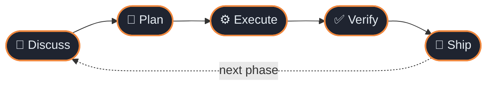
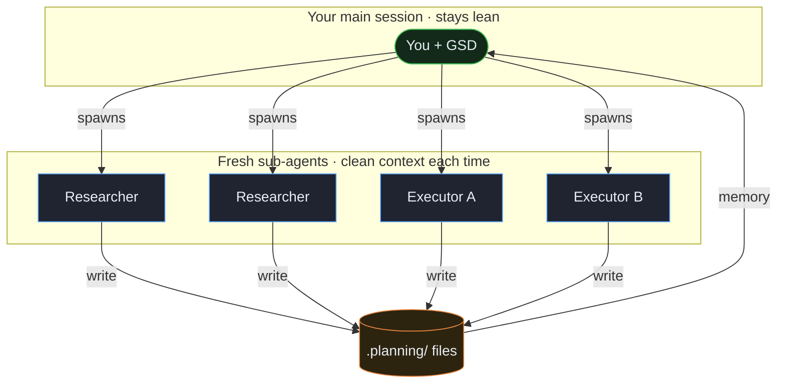
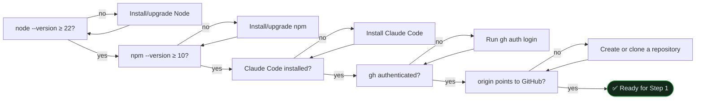
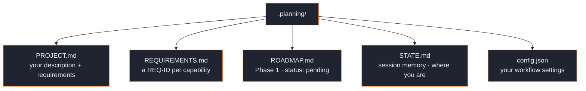
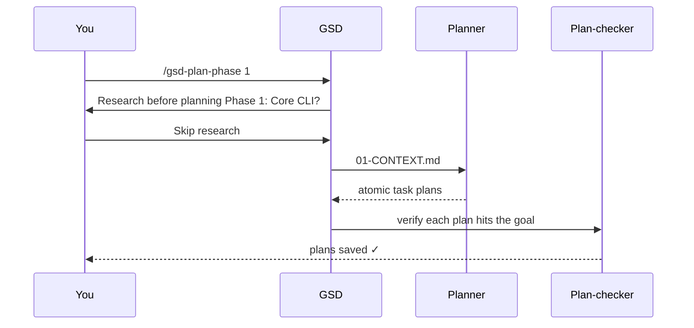
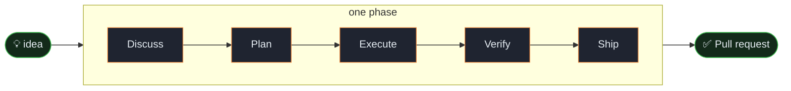

<div align="center">

# 🚀 Your first project

**From an empty GitHub repository to a shipped pull request — in one guided loop.**


</div>

> [!TIP]
> **This is the one guaranteed path.** You will build a tiny app, run **every**
> command in the core loop exactly once, and — the part most tutorials skip —
> understand *why* each step exists. This tutorial uses **Claude Code**; GSD
> works in 15+ runtimes — see [Install on your runtime](../how-to/install-on-your-runtime.md)
> for the flag and command syntax for yours.

---

## 📖 Table of contents

1. [The one idea that makes GSD click](#-the-one-idea-that-makes-gsd-click)
2. [What you'll build](#-what-youll-build)
3. [Prerequisites](#-prerequisites)
4. [Step 1 — Install GSD Core](#step-1--install-gsd-core-into-your-runtime)
5. [Step 2 — Open Claude Code](#step-2--open-claude-code)
6. [Step 3 — Create the project](#step-3--create-the-project)
7. [Step 4 — Discuss Phase 1](#step-4--clear-context-then-discuss-phase-1)
8. [Step 5 — Plan Phase 1](#step-5--plan-phase-1)
9. [Step 6 — Execute Phase 1](#step-6--execute-phase-1)
10. [Step 7 — Verify the work](#step-7--verify-the-work)
11. [Step 8 — Ship it](#step-8--ship-it)
12. [Glossary](#-mini-glossary) · [Troubleshooting](#-troubleshooting) · [What next](#-what-next)

---

## 💡 The one idea that makes GSD click

GSD Core does **not** "write your whole app in one shot." It runs a **repeating
five-step loop**, and it does the heavy thinking in **fresh, throwaway
sub-agents** so your main chat window never fills up with clutter — the quality
killer GSD calls [context rot](../explanation/context-engineering.md).

You drive that loop **one phase at a time**:



| Step | Command | In one sentence | Typical time |
|:----:|---------|-----------------|:------------:|
| 💬 **Discuss** | `/gsd-discuss-phase` | GSD asks *how* to build it and writes your answers down. | 2–4 min |
| 📐 **Plan** | `/gsd-plan-phase` | GSD splits the work into small, checkable task plans. | 1–5 min |
| ⚙️ **Execute** | `/gsd-execute-phase` | Fresh agents write the code and commit each task. | 2–6 min |
| ✅ **Verify** | `/gsd-verify-work` | GSD walks you through "does it actually work?" | 1–3 min |
| 🚀 **Ship** | `/gsd-ship` | A pull request is opened for you. | <1 min |

> [!NOTE]
> **Keep that table handy.** Whenever you feel lost, ask yourself one question:
> *"which step of the loop am I on?"* That's the entire mental model.

<details>
<summary>🧠 <b>Why fresh sub-agents? (the 30-second version)</b></summary>

<br>

A single long chat slowly degrades: the more it holds, the more the model
juggles, and quality quietly drops. GSD sidesteps this by spawning a **clean
200k-token worker** for each heavy job (research, execution) and throwing it away
after. Your main session stays lean; the shared `.planning/` files carry memory
between them.



</details>

---

## 🎯 What you'll build

A small **Node.js command-line to-do app**:

```bash
todo add "buy milk"      # ➕ add an item
todo list                # 📋 see open items
todo done 1              # ✅ complete item 1
```

Items live in a local `todos.json`. It uses **only the Node.js standard library**
— nothing to install, nothing to configure — so you focus entirely on the GSD
loop, not a toolchain.

> [!TIP]
> Small on purpose. Once the loop is muscle memory, the *exact same* eight steps
> scale to a real multi-phase product.

---

## ✅ Prerequisites

| You need | Check with | "Good" looks like |
|----------|------------|-------------------|
| **Node.js 22+** | `node --version` | `v22.x.x` or higher |
| **npm 10+** | `npm --version` | `10.x.x` or higher |
| **Claude Code** | `claude --version` | installed and opens |
| **Git** | `git --version` | installed |
| **GitHub CLI** | `gh --version` and `gh auth status` | installed and authenticated |
| **An empty GitHub repository cloned locally** | `git remote get-url origin` | your repository's GitHub URL |
| **Internet** | — | available for installation and GitHub operations |

If you do not already have an empty repository, create and clone one now. If
`gh auth status` says you are not logged in, run `gh auth login` first.

```bash
gh repo create gsd-todo-tutorial --private --clone
cd gsd-todo-tutorial
git remote get-url origin
```



---

## Step 1 — Install GSD Core into your runtime

From a terminal **in your project directory**, run the installer:

```bash
npx @opengsd/gsd-core@latest --claude --local
```

This tutorial uses `--local`, so GSD is installed only in this project. On a
different runtime? See [Install on your runtime](../how-to/install-on-your-runtime.md)
for its flag. You'll see a summary of what was installed, e.g.:

```text
✓ Installed 71 commands to commands/ (gsd-<cmd>.md flat form)
✓ Installed agents
```

Then **restart Claude Code** so it picks up the new commands and agents.

<details>
<summary>💡 <b>What just happened?</b></summary>

<br>

A `.claude/` directory in your project now holds GSD's **commands** and
**agents**. You never edit these by hand — the installer owns them and keeps them
in Claude Code's native format.

</details>

> [!WARNING]
> **Don't copy files from `agents/` or `commands/` directly** — that bypasses the
> installer's transformations and produces schema errors or missing commands.
> Always use the installer.

---

## Step 2 — Open Claude Code

For this disposable tutorial project, open (or restart) Claude Code in your
project directory with:

```bash
claude --dangerously-skip-permissions
```

You'll land at a prompt ready for input.

> [!CAUTION]
> **The permissions flag is optional.** It skips per-file confirmation while
> GSD's sub-agents read and write files. Use it only for this throwaway tutorial
> in an empty folder. To keep confirmations enabled, start with `claude` instead.
> For real work, read the [security model](../explanation/security-model.md) first.

<details>
<summary>💡 <b>What just happened?</b></summary>

<br>

Claude Code opened in the project where Step 1 installed GSD. It loaded the
project-local `.claude/` commands and agents, so `/gsd-*` commands are now
available at the prompt.

</details>

---

## Step 3 — Create the project

At Claude Code's prompt:

```text
/gsd-new-project
```

The first question is always **"What do you want to build?"** Paste this:

```text
A Node.js CLI tool for managing to-do items. Users run `todo add "buy milk"`,
`todo list`, and `todo done 1`. Items are saved to a local todos.json file.
No external dependencies — Node built-ins only.
```

Then answer the **clarifying questions**, choose **No** when asked *"Research before planning each phase? (adds tokens/time)"* (skip it for this small build), take the
**recommended defaults** for workflow settings, and wait for the **roadmapper**
(~1 min). Type **Approve** on the proposed roadmap:

```text
Proposed Roadmap
1 phase | 4 requirements mapped | All v1 requirements covered ✓

| # | Phase    | Goal                                   | Requirements    |
|---|----------|----------------------------------------|-----------------|
| 1 | Core CLI | add / list / done commands, todos.json | CLI-01 … CLI-04 |
```

<details>
<summary>💡 <b>What just got created in <code>.planning/</code>?</b></summary>

<br>



These files are GSD's **shared memory** — they survive `/clear`, survive closing
your laptop, and let a fresh sub-agent pick up exactly where the last left off.

</details>

👉 **Do this now:** open `.planning/ROADMAP.md`. Phase 1 has a **Goal**,
**Requirements**, and **Success Criteria** — the observable behaviors execution
must deliver. This file is your map for the rest of the tutorial.

---

## Step 4 — Clear context, then discuss Phase 1

GSD is built around **fresh contexts**. Clear the window before each phase:

```text
/clear
```

Then open the discussion:

```text
/gsd-discuss-phase 1
```

GSD asks about your **implementation preferences** — *how* to build, not just
*what*:

```text
> How should done items be stored — mark them in place or move them?
  Mark them in place with a "done" flag.
> Should `todo list` show completed items by default?
  No, hide them unless --all is passed.
> What if todos.json doesn't exist yet?
  Create it silently on first add.
```

It writes `.planning/phases/01-core-cli/01-CONTEXT.md`.

👉 **Do this now:** open that file → find `## Implementation Decisions`. Those are
your words, captured. The planner reads this next, so every decision here flows
into the task plans.

> [!NOTE]
> **Why discuss before planning?** Decide the small stuff up front and the plan is
> right the first time — instead of you correcting a wrong plan, choice by choice.

<details>
<summary>💡 <b>What just happened?</b></summary>

<br>

`/clear` discarded the old chat context, then `/gsd-discuss-phase 1` captured
your implementation choices in `01-CONTEXT.md`. The next planner receives those
decisions without needing the earlier conversation.

</details>

---

## Step 5 — Plan Phase 1

```text
/gsd-plan-phase 1
```



GSD asks **"Research before planning Phase 1: Core CLI?"** — choose **Skip research** (same
as Step 3; this build is small and well-understood). A **planner** then turns
`01-CONTEXT.md` into **atomic task plans**, and a **plan-checker** verifies each
before saving.

<details>
<summary>💡 <b>What just got created?</b></summary>

<br>

```text
.planning/phases/01-core-cli/
  01-01-PLAN.md       ← Task: todos.json read/write helpers
  01-02-PLAN.md       ← Task: add / list / done commands
```

</details>

👉 **Do this now:** open `01-01-PLAN.md`. Inside the `<task>` block: a name, the
files it touches, action steps, a `<verify>` command, and a "done" condition.
That `<verify>` isn't decoration — the executor runs it after writing code.

---

## Step 6 — Execute Phase 1

```text
/gsd-execute-phase 1
```

GSD groups plans into **waves** (independent plans run in parallel), spawns a
**fresh 200k-context executor per plan**, and commits each task atomically:

```text
Wave 1 (parallel):
  [Executor A] → 01-01-PLAN.md (read/write helpers)   ✓ committed
  [Executor B] → 01-02-PLAN.md (CLI commands)          ✓ committed

[Verifier] Checking codebase against phase goals...
  CLI-01 todo add   ✓   CLI-03 todo done  ✓
  CLI-02 todo list  ✓   CLI-04 --all flag ✓
  Status: PASS
```

**Run your app** — your first visible result:

```bash
node todo.js add "buy milk"
node todo.js add "write tests"
node todo.js list        # → both items
node todo.js done 1
node todo.js list        # → only "write tests"
```

🎉 Item 1 disappears from the default list after `done`. It works.

<details>
<summary>💡 <b>What just got created?</b></summary>

<br>

```text
.planning/phases/01-core-cli/
  01-01-SUMMARY.md    ← what Executor A built + committed
  01-02-SUMMARY.md    ← what Executor B built + committed
  01-VERIFICATION.md  ← requirement coverage: PASS
```

</details>

---

## Step 7 — Verify the work

```text
/gsd-verify-work 1
```

GSD reads the phase's `SUMMARY.md` files and turns their user-visible
deliverables into checkpoints. It presents one checkpoint at a time; the first
one looks like this (the test wording depends on what was built):

```text
╔══════════════════════════════════════════════════════════════╗
║  CHECKPOINT: Verification Required                           ║
╚══════════════════════════════════════════════════════════════╝

**Test 1: Add a to-do**

Running `node todo.js add "buy milk"` creates a pending item without errors.

──────────────────────────────────────────────────────────────
Type `pass` or describe what's wrong.
──────────────────────────────────────────────────────────────
```

Type `pass` when reality matches, or describe what differs. GSD records the
answer in `01-UAT.md` and then presents the next checkpoint.

If a check **fails**, GSD diagnoses the root cause and writes a fix plan → re-run
`/gsd-execute-phase 1`, then `/gsd-verify-work 1` again. (Result:
`.planning/phases/01-core-cli/01-UAT.md`.)

> [!NOTE]
> **Why a separate verify step?** "The code was written" and "the code works" are
> different claims. Verify proves the second one *before* you open a PR.

<details>
<summary>💡 <b>What just happened?</b></summary>

<br>

GSD turned the phase summaries into user-visible checks, recorded your answers
in `01-UAT.md`, and routed any failure back through a concrete fix plan. Shipping
only starts after those checks match reality.

</details>

---

## Step 8 — Ship it

```text
/gsd-ship 1
```

GSD creates a pull request with a generated body (Summary · Changes ·
Requirements Addressed · Verification · Key Decisions):

```text
Pull request created: https://github.com/your-org/your-repo/pull/1
Title: Phase 01: core-cli
```

That's the **full loop** — idea → opened PR — for one phase, start to finish. 🚀



<details>
<summary>💡 <b>What just happened?</b></summary>

<br>

`/gsd-ship 1` assembled the completed phase's requirements, decisions, and
verification evidence into a pull request. The PR is open for review; nothing
has been merged into the default branch yet.

</details>

---

## 🔁 Doing more than one phase

For a multi-phase project, repeat **Steps 4–8** for each phase. Not sure what's
next? Let GSD detect it:

```text
/gsd-progress --next
```

---

## 📚 Mini-glossary

| Term | Meaning in GSD |
|------|----------------|
| **Runtime** | Your AI coding tool. This tutorial uses Claude Code. |
| **Phase** | One slice of the roadmap you take through the whole loop. |
| **The loop** | Discuss → Plan → Execute → Verify → Ship. |
| **Sub-agent** | A fresh, throwaway worker GSD spawns for research or execution. |
| **Context rot** | Quality decay as the main window fills up; fresh sub-agents prevent it. |
| **`.planning/`** | GSD's shared memory: PROJECT, REQUIREMENTS, ROADMAP, STATE, per-phase files. |
| **Requirement (REQ-ID)** | A single v1 capability the roadmap must cover, e.g. `CLI-01`. |
| **Success criteria** | Observable behaviors a phase must deliver, checked in Verify. |
| **Wave** | A batch of independent task plans executed in parallel. |

---

## 🛟 Troubleshooting

| Symptom | Likely cause | Fix |
|---------|--------------|-----|
| A GSD command isn't recognized | Claude Code not restarted after install | Restart Claude Code so it loads the new `/gsd-*` commands. |
| `Spawning researchers…` looks stuck | Research runs 1–5 min | Wait — don't interrupt. If truly hung, `/clear` and re-run the step. |
| Verify keeps failing | Real bug in the code | Let GSD write the fix plan → `/gsd-execute-phase 1` → re-verify. |
| Lost track of where you are | — | Open `.planning/STATE.md`, or run `/gsd-progress --next`. |
| Wrong install directory | Alternate/prerelease Claude Code config dir | Set `CLAUDE_CONFIG_DIR` to match — see [Install on your runtime](../how-to/install-on-your-runtime.md). |

---

## 🎓 What next

- [Install on your runtime](../how-to/install-on-your-runtime.md) — exact steps for every supported runtime
- [The phase loop](../explanation/the-phase-loop.md) — why it's shaped this way
- [Context engineering](../explanation/context-engineering.md) — the theory behind fresh sub-agents
- [Configure model profiles](../how-to/configure-model-profiles.md) — quality / balanced / budget tiers
- [Onboarding an existing codebase](onboarding-an-existing-codebase.md) — bring GSD to a brownfield repo

> [!TIP]
> **You now know the whole loop.** Everything else in GSD is a refinement of these
> eight steps. Welcome aboard. 🚀
